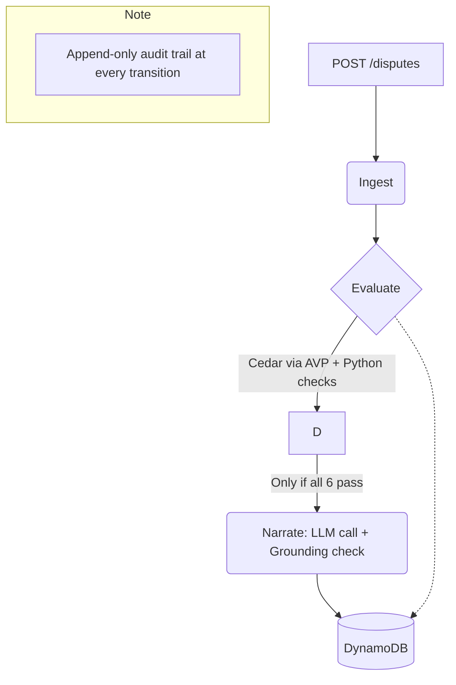

<div align="center">
  <h1>🛡️ Recourse</h1>
  <p><b>Evidence for disputes an AI agent made on your behalf.</b></p>
</div>

---

## 🔍 The Problem

In February 2026, Razorpay and NPCI launched an agentic payments pilot on Claude, letting people order from Zomato, Swiggy, and Zepto through conversation, using **UPI Reserve Pay** — a user pre-authorises a spending cap for a merchant, then an agent transacts within it.

> [!WARNING]  
> When one of those transactions is disputed, the evidence a merchant normally relies on doesn't exist: **no device fingerprint, no click trail, no browser session**, because no human clicked anything. Nothing off-the-shelf handles that yet.

---

## 🚫 What This Is Not

Recourse doesn't integrate with real UPI, Razorpay, or NPCI — every dispute is synthetic, shaped like the real thing. 

- **No login:** It's a demo console, not a product.
- **No simulation:** It doesn't build or simulate the shopping agent itself; it only consumes an agent's action log after the fact.

---

## 🧠 How It Decides

Every dispute goes through **six deterministic checks**. 

1. **Cedar Policies** (Evaluated by Amazon Verified Permissions):
   - Spending cap
   - Merchant match
   - Mandate validity window
2. **Python Checks**:
   - Order fulfilment
   - Timeline consistency
   - Duplicate-order detection

> [!IMPORTANT]  
> **The model never decides anything. It writes prose.**  
> Deterministic code decides whether that prose is trustworthy enough to show a human.

If all six pass, a language model writes a short evidence narrative. But the narrative is checked against the same structured facts before it's ever shown to anyone. If it mentions something structurally impossible for an agent-initiated transaction (a device fingerprint, an IP address, a click), or cites a number that appears nowhere in the real data, it's rejected and the dispute escalates to a human instead. 

**One generation attempt, no retries** — a failed check means escalation, never a second try hoping for a better answer.

---

## 🏗️ Architecture



- **Backend:** Python 3.12 on AWS Lambda, Amazon Verified Permissions for policy evaluation, DynamoDB for storage, API Gateway as the HTTP front door, all declared in one AWS SAM template. 
- **Frontend:** React, TypeScript, Tailwind, deployed on AWS Amplify Hosting.

---

## 🚀 Running It Locally

### Prerequisites
- Python 3.12, Node 20
- AWS CLI, AWS SAM CLI
- AWS account configured with `AdministratorAccess` credentials

### 1. Setup & Backend Deployment
```bash
git clone <repo-url> && cd recourse

# Setup Python virtual environment
python3 -m venv .venv && source .venv/bin/activate
pip install -r requirements.txt --break-system-packages

# Run backend tests
pytest

# Build and deploy the AWS SAM stack
cd infra && sam build && sam deploy --guided 
```
> Take note of the `ApiUrl` output from the deployment.

### 2. Run the Frontend
```bash
cd ../web
npm install

# Start the dev server
VITE_API_URL=<api-url-from-above> npm run dev
```

### 3. Seed the Dataset
The seed dataset (120 synthetic disputes, 100 live + 20 held out with labels) is generated by `data/seed/generate_dataset.py` and posted to the deployed API.

```bash
cd data/seed
export API_URL="<api-url-from-above>"
python3 generate_dataset.py
```

---

## 🌐 Live Demo

- **App:** [https://master.d285ptzirlim8s.amplifyapp.com](https://master.d285ptzirlim8s.amplifyapp.com)
- **API:** [https://63v98k3fpe.execute-api.us-east-1.amazonaws.com/prod/disputes](https://63v98k3fpe.execute-api.us-east-1.amazonaws.com/prod/disputes)

---

## 📝 Limitations, honestly

> [!NOTE]  
> - **All data is synthetic.** This has never touched a real payment.
> - **No authentication anywhere** — a deliberate scope decision for a four-day demo, not an oversight.
> - **Bedrock access** was blocked for the account this was built on by an AWS account-verification hold that didn't clear in time. The `narrate` service calls a free-tier LLM API directly instead — the decision logic and grounding check are provider-agnostic and don't change based on which model writes the prose.
> - A small number of early audit-log entries had their display order reconstructed after a same-second timestamp collision, caused by rapid manual testing during development. Entries written from that point forward use microsecond-precision sort keys and don't have this issue.
> - Precision and recall on the held-out set are both **1.0**. This is a deterministic rule engine evaluated against synthetic cases with unambiguous ground truth, not a trained model generalising to unseen data — a correctly implemented deterministic system is expected to score close to perfect on clean-cut cases. It isn't a claim that the system is infallible on messier real data.

---

## 🏆 Built For

**Bharat Builds Tour — First Commit**  
WeMakeDevs × AWS Builder Center, 17–20 September 2026.
